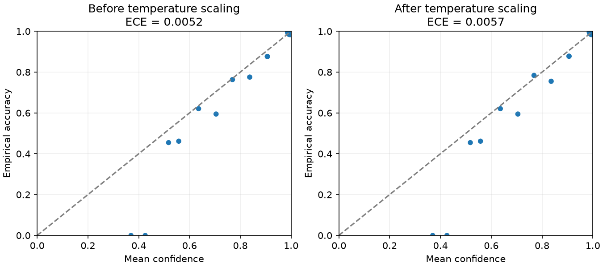

# First standalone MVP results

Measured on 2026-10-06 with [mvp.json](mvp.json) and the fixed
[experiment design](mvp-design.md). This is a synthetic policy-imitation
experiment; it does not demonstrate operational effectiveness.

## Reproduce

```sh
uv sync --locked
uv run pytest
uv run system-one run --config experiments/mvp.json --output artifacts/reproduction
uv run system-one decide --model artifacts/reproduction/model.pt --state experiments/example-state.json
```

Reference runs: `artifacts/mvp-v1` and `artifacts/mvp-v1-repeat`.
Both produced bitwise-identical model weights and identical non-timing metrics.
All 3,000 final test actions agreed with the public `model.decide` interface;
maximum batch-versus-single-state probability difference was 0.000001252.
Timing and environment timestamps naturally differ. Tests: **43 passed**.

## Configuration

- 20,000 seeded states; 14,000 train, 1,500 model selection, 1,500 calibration, 3,000 test.
- Clean latent labels from `server-policy-v1`; noisy observations are the model inputs.
- MLP 6 → 256 → 128 → 5, 35,333 parameters; saved artifact 144,765 bytes.
- CPU, one thread, Python 3.12.8, macOS arm64.
- NumPy 2.5.3, PyTorch 2.14.1, scikit-learn 1.9.1, Matplotlib 3.11.2.
- Training stopped after 50 epochs; best selection loss was at epoch 38.
- Temperature 0.998756573; validation-selected threshold 0.8, meeting the
  calibration-subset accepted-accuracy target with the configured confidence floor.

## Held-out results

| Metric | Value |
| --- | ---: |
| Rule baseline on clean states | 100% accuracy |
| Rule baseline on noisy states | 95.37% accuracy |
| Model argmax accuracy | 96.97% |
| Model argmax macro F1 | 0.96928 |
| Final accuracy after escalation overrides | 96.63% |
| Final macro F1 after escalation overrides | 0.96637 |
| Accuracy among non-escalated decisions | 99.37% |
| Non-escalated coverage | 79.90% (2,397 / 3,000) |
| Escalation rate | 20.10% |
| Low-confidence overrides | 4.83% |
| Raw errors with confidence ≥ 0.9 | 15 / 2,775 confident predictions (0.54%) |

Coverage excludes all escalation decisions, including correctly predicted
policy escalations. The accepted-accuracy improvement comes with fewer
automatic decisions, not an increase in overall classification accuracy.

| Probability metric | Before scaling | After scaling |
| --- | ---: | ---: |
| Brier score | 0.04114192 | 0.04114573 |
| NLL | 0.06894854 | 0.06895494 |
| ECE, 15 bins | 0.00524657 | 0.00566318 |

Temperature scaling slightly improved calibration-subset NLL, but **did not
improve held-out calibration**. The empirical improvement criterion in issue 16
is therefore not established by this run. Global ECE is small, but sparsely
populated low-confidence bins still show disagreement.



## CPU latency

| Run | Mean | p95 | p99 |
| --- | ---: | ---: | ---: |
| First | 0.254 ms | 0.613 ms | 0.851 ms |
| Repeat | 0.213 ms | 0.559 ms | 0.865 ms |

Each measurement uses 1,000 calls after 100 warmup calls, batch size one,
including input validation and the complete decision wrapper. Loading and
file I/O are excluded. These are local measurements, not deployment guarantees.

## Failure cases and unseen states

Of the 15 confident test errors, 14 observations cross a policy boundary under
measurement noise, while one retains the same clean/observed policy label.
This records ambiguity; it does not explain away model mistakes. One dangerous
example has CPU 86.17%, error rate 0.1057 and latency 769.57 ms: the model recommends
`SCALE_OUT` with confidence 0.9358, while the clean label is `RESTART` and the
noisy-state rule baseline says `ESCALATE`.

Each OOD family contains 100 valid states excluded from fitting:

| Scenario | Mean confidence | Escalation rate | Synthetic policy agreement |
| --- | ---: | ---: | ---: |
| Extreme latency | 0.99999957 | 0% | 0% |
| High CPU / almost no traffic | 0.99999435 | 100% | 100% |
| Near range limits | 1.00000000 | 0% | 0% |

The model predicts `RESTART` in all extreme-latency and near-limit cases,
where the synthetic policy respectively specifies `NO_ACTION` and `ESCALATE`.
All 200 are confident errors. Confidence thresholding does not detect them.
The oracle itself also has a limitation: extreme latency alone does not trigger
an action at moderate resource utilization.

The MVP is runnable, but these results do not justify 5G integration. Continue
the standalone investigation of uncertainty and OOD failures before expanding
the architecture. Future experiments should preserve this reference dataset
and policy, or explicitly version any research-design change.

The tracked [result summary](mvp-results.json) preserves the measured numbers.
Full confusion matrices, per-action metrics, all failure inputs, probes, splits,
source hashes and environment information are retained in the local run artifacts.
